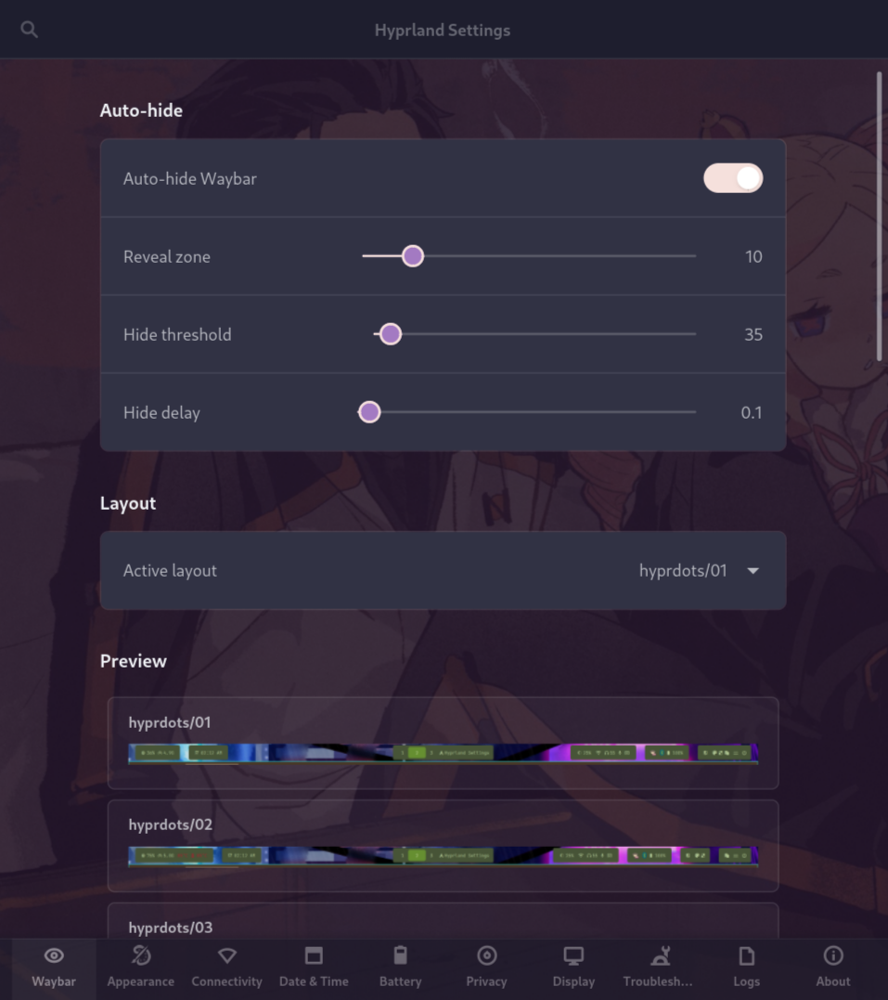

# Hyprland Settings

A little settings app for my **HyDE + Hyprland** setup. Instead of digging through
config files, you get one small window to tweak the Waybar, wallpaper, theme, battery,
Wi-Fi and more. Bonus: it's see-through and recolors itself to match whatever theme
you're using.



## What it does

- **Waybar** – make the bar hide and slide back in when your mouse hits the top (like the Windows taskbar), tune how sensitive that is, and switch bar layouts with a little preview of each.
- **Appearance** – change your theme, pick a wallpaper, or set a video as a live wallpaper.
- **Wi-Fi & Bluetooth** – toggle them, peek at / copy your Wi-Fi password, or open the full managers.
- **Date & Time** – clock, calendar, auto time, timezone.
- **Battery** – charge, a live power-usage graph, battery health, power modes (saver / balanced / performance), and what's hogging your CPU.
- **Privacy** – flip location on or off.
- **Display** – mirror or extend to a second screen.
- **Troubleshoot & Logs** – quick fixes if the bar acts up, plus a log of everything the app changed.

## The live wallpaper won't kill your battery

It plays a video as your wallpaper, but it's smart about it — it **pauses the moment a
window covers the desktop** (so basically 0% CPU while you're working) and only plays
when you can actually see it. It also doesn't start on its own at boot.

## What you need

You're on HyDE, so you probably already have most of this. The essentials:

```
python python-gobject gtk4 libadwaita hyprland waybar jq grim networkmanager bluez-utils power-profiles-daemon
```

Only if you want the extra bits:

```
mpvpaper socat   # live video wallpaper
nwg-displays     # the display arranger
geoclue          # the location toggle
```

> It's built for HyDE, so it leans on HyDE's own tools (like `hyde-shell`) and its Waybar layouts and themes.

## Get it

```bash
git clone https://github.com/Aryan1-hash/hypr-settings.git
cd hypr-settings
./install.sh
```

Then open **Hyprland Settings** from your app menu — or run:

```bash
python3 ~/.local/share/hypr-settings/hypr-settings.py
```

## Remove it

```bash
./uninstall.sh          # removes the app, keeps your settings
./uninstall.sh --purge  # removes everything, settings included
```

## Good to know

- Your settings live in `~/.config/hypr-settings/`, and anything the app changes is logged (and backed up first) in `~/.local/share/hypr-settings/logs/` — so you can always see or undo what it did.
- It doesn't show exact per-app battery drain on purpose: the tools that measure that accurately end up draining the battery themselves, so it shows top CPU usage as a rough stand-in instead.
- "Location" on Linux isn't real GPS — it's Wi-Fi/IP based (GeoClue), and the toggle only appears if that's installed.

## License

MIT — do whatever you want with it.
